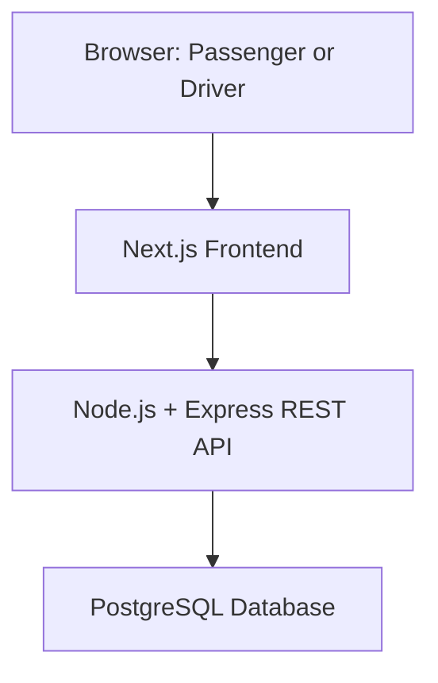

# Architecture Plan

Status: Planned. Application implementation has not started.

## System Diagram

## Frontend Responsibilities

- Display passenger and driver screens.
- Collect login and ride-request inputs.
- Show fare estimates, ride status, and history.
- Call the backend API.
- Show loading, error, and empty states.

The frontend does not decide final fares, access permissions,
or whether seats can be allocated.

## Backend Responsibilities

- Authenticate users and enforce passenger/driver permissions.
- Validate incoming requests.
- Match compatible ride requests.
- Calculate individual fares.
- Enforce vehicle capacity.
- Validate ride-state transitions and cancellation rules.
- Record changes in ride history.
- Return consistent API responses and errors.

## Database Responsibilities

- Persist users, vehicles, requests, pools, and memberships.
- Maintain relationships and constraints.
- Store money as integer poisha.
- Support transactions for consistent seat allocation.
- Preserve ride and status history.

## Proposed Technology Choices

### Next.js

Chosen for the frontend because it provides page routing and
supports organizing passenger and driver screens in one project.

Alternative: React with React Router.

Reconsider if the product later requires a separate native mobile UI.

### Node.js with Express

Node.js is required by the challenge.
Express is proposed for a small API with explicit routes,
middleware, and business services.

Alternative: NestJS for stronger architectural conventions.

Reconsider if the backend grows enough that more enforced
structure would benefit the team.

### PostgreSQL

Proposed because the application has related entities and requires
transactional consistency for seat allocation.

Alternatives: MySQL or SQLite.

Reconsider based on operational needs and deployment constraints.

### REST API

Proposed because the MVP has clear resource operations:
create requests, view trips, cancel requests, and update trip status.

Alternative: GraphQL.

Reconsider if clients later need substantially different combinations
of related data.

## Seat Allocation

Seat allocation will use a database transaction:

1. Lock the target pool row.
2. Check pool status and remaining capacity.
3. Add the request membership if enough seats remain.
4. Update occupied seats and append history.
5. Commit all changes together.

Every operation that changes pool membership or occupied seats
must follow the same locking rule.

A unique membership constraint will prevent the same request
from being allocated twice.

## Initial Status Updates

The frontend will periodically fetch active ride status from the API.
WebSockets are a possible later improvement.

## Deployment Plan

Docker Compose will run the frontend, backend, and database.
Environment variables will be documented in .env.example.
Public hosting will use free services if feasible.

## Scope

The MVP uses predefined Dhaka areas and route groups.
It does not require a real routing engine or payment gateway.