# Database Design

Status: Planned. Database implementation has not started.

Database: PostgreSQL.

## Entity Relationship Diagram

```mermaid
erDiagram
    USERS ||--o| VEHICLES : owns
    USERS ||--o{ RIDE_REQUESTS : submits
    USERS ||--o{ POOLS : drives
    VEHICLES ||--o{ POOLS : serves
    POOLS ||--o{ POOL_MEMBERSHIPS : contains
    RIDE_REQUESTS ||--o| POOL_MEMBERSHIPS : joins
    RIDE_REQUESTS ||--o{ REQUEST_STATUS_HISTORY : records
    POOLS ||--o{ POOL_STATUS_HISTORY : records
```

## 1. Users

Stores passenger and driver accounts.

| Field | Type | Rule |
| --- | --- | --- |
| id | UUID | Primary key |
| name | Text | Required |
| email | Text | Unique; normalized to lowercase |
| password_hash | Text | Never store plaintext passwords |
| role | Text | PASSENGER or DRIVER |
| is_online | Boolean | Default false; used for drivers |
| created_at | TIMESTAMPTZ | Required |

MVP assumption: each account has one role.

## 2. Vehicles

Stores the driver's vehicle and fixed passenger capacity.

| Field | Type | Rule |
| --- | --- | --- |
| id | UUID | Primary key |
| driver_id | UUID | Unique foreign key to users |
| name | Text | Required; demo vehicle is Bullet |
| capacity | Integer | Greater than zero |
| created_at | TIMESTAMPTZ | Required |

MVP assumption: one vehicle per driver.
Bullet has 3 passenger seats.
Vehicle ownership and capacity cannot change during an active trip.

## 3. Ride Requests

Stores each passenger's individual booking request.

| Field | Type | Rule |
| --- | --- | --- |
| id | UUID | Primary key |
| passenger_id | UUID | Foreign key to users |
| pickup_zone | Text | Valid predefined area |
| destination_zone | Text | Valid predefined area |
| route_group | Text | Derived by the backend |
| seats | Integer | Greater than zero |
| status | Text | Valid request status |
| estimated_fare_poisha | Integer | Zero or greater |
| final_fare_poisha | Integer | Nullable until trip start |
| created_at | TIMESTAMPTZ | Required |
| updated_at | TIMESTAMPTZ | Required |

Request statuses:
REQUESTED, ACCEPTED, DRIVER_ARRIVED, STARTED, COMPLETED, CANCELLED.

Only the owning passenger can view or cancel their request.
Assigned drivers can view information needed to operate the trip.

## 4. Pools

Stores the shared trip operated by one driver and vehicle.

| Field | Type | Rule |
| --- | --- | --- |
| id | UUID | Primary key |
| driver_id | UUID | Foreign key to users |
| vehicle_id | UUID | Foreign key to vehicles |
| pickup_zone | Text | Shared pickup zone |
| route_group | Text | Compatible destination group |
| capacity | Integer | Vehicle capacity snapshot |
| occupied_seats | Integer | Between zero and capacity |
| status | Text | Valid pool status |
| created_at | TIMESTAMPTZ | Required |
| started_at | TIMESTAMPTZ | Nullable |
| completed_at | TIMESTAMPTZ | Nullable |

Pool statuses:
ACCEPTED, DRIVER_ARRIVED, STARTED, COMPLETED, CANCELLED.

A pool is created when a driver accepts an initial request.
Compatible requests can join an ACCEPTED pool before driver arrival.
Joining an existing pool counts as driver acceptance under this MVP rule.
The driver sees all assigned memberships.

Only one active pool is allowed per driver and per vehicle.

## 5. Pool Memberships

Links individual requests to a shared trip.

| Field | Type | Rule |
| --- | --- | --- |
| id | UUID | Primary key |
| pool_id | UUID | Foreign key to pools |
| request_id | UUID | Unique foreign key to ride_requests |
| seats | Integer | Allocated seats; greater than zero |
| joined_at | TIMESTAMPTZ | Required |
| cancelled_at | TIMESTAMPTZ | Nullable |

MVP assumption: a request can join at most one pool.
A passenger must create a new request after cancellation.

Cancelled memberships remain stored for history but do not occupy seats.
Membership seats must equal the associated request's requested seats.
Passenger fare is stored on the ride request to avoid duplicate fare records.

## 6. Request Status History

Records individual request status changes.

| Field | Type | Rule |
| --- | --- | --- |
| id | UUID | Primary key |
| request_id | UUID | Foreign key to ride_requests |
| from_status | Text | Nullable for initial creation |
| to_status | Text | Required |
| actor_user_id | UUID | Nullable for system actions |
| reason | Text | Optional |
| created_at | TIMESTAMPTZ | Required |

## 7. Pool Status History

Records shared trip status changes.

| Field | Type | Rule |
| --- | --- | --- |
| id | UUID | Primary key |
| pool_id | UUID | Foreign key to pools |
| from_status | Text | Nullable for initial creation |
| to_status | Text | Required |
| actor_user_id | UUID | Nullable for system actions |
| reason | Text | Optional |
| created_at | TIMESTAMPTZ | Required |

## Consistency Rules

- Allocate seats inside a transaction that locks the pool row.
- Coordinate joining, cancellation, arrival, and trip start using
  the same pool lock.
- For cancellation before assignment, lock the request row.
- When both rows are needed, lock the pool before the request.
- Recheck request and pool statuses after acquiring locks.
- Update membership, occupied seats, fares, and history atomically.
- occupied_seats must equal the sum of non-cancelled membership seats.
- Reject duplicate assignment using the unique request_id constraint.
- Reject invalid status transitions in backend services.
- Record state changes in the same transaction as the update.
- Preserve historical records; avoid cascading deletion of ride history.
- If the last active member cancels, cancel the pool.
- At trip start, lock final fares for all active requests.
- Driver trip actions update active request statuses consistently.

Cross-table rules, such as driver role and vehicle ownership,
must be checked by backend services within relevant transactions.
Database CHECK constraints alone cannot enforce all these rules.

## Planned Indexes

- Unique index on users.email.
- Unique index on vehicles.driver_id.
- Index on ride_requests(passenger_id, created_at).
- Index on ride_requests(status, pickup_zone, route_group).
- Index on pools(status, pickup_zone, route_group).
- Index on pools(driver_id, created_at).
- Index on pool_memberships.pool_id.
- Unique index on pool_memberships.request_id.
- Index on request_status_history(request_id, created_at).
- Index on pool_status_history(pool_id, created_at).
- Partial unique indexes on pools.driver_id and pools.vehicle_id
  for active statuses: ACCEPTED, DRIVER_ARRIVED, STARTED.

## Money and Time

Store money as integer poisha:
BDT 50 = 5000 poisha.

Store timestamps as TIMESTAMPTZ and display them in the user's timezone.

## Demo Data Plan

- Jashim: driver.
- Bullet: Jashim's vehicle, capacity 3.
- Nusrat, Rafiq, Shirin: passengers.
- Demo requests use the documented Banani route group.